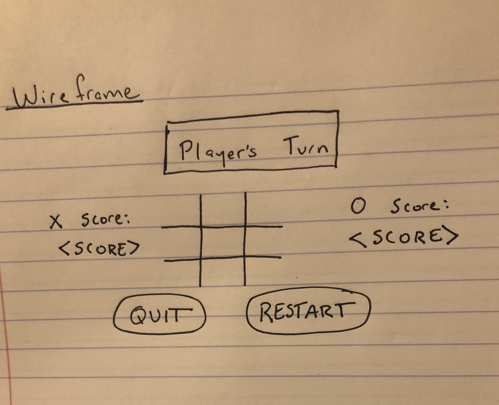

# Tic-Tac-Toe: An Overview
Pretty much everyone is familiar with the classic game **Tic Tac Toe**. Most of you reading this have probably played it a time or two in the past (maybe even during work meetings that could've **definitely** been an e-mail). 

While the game seems simple on the surface level, there's a lot of logic behind the scenes that we humans take for granted. Computers are not able to make logical inferences like we are - they're literally composed of plastic and metal! You can literally say they are as dumb as a box of rocks. 

While frustrating at times, I am proud to introduce you to my very first game. Please feel free to tear it apart... constructive criticism is welcome.

## Wanna Play?
[Direct link to Tic Tac Toe live game](https://yellowlighte.github.io/Tic-Tac-Toe/index.html)

Clicking on the link above will take you directly to the live version of the game.

### Technologies Used
The main technologies used in this project are as follows:
- HTML
- CSS
- JavaScript

### Wireframe

### User Stories
- Players can start a game of Tic Tac Toe
- Players should be able to easily determine whose turn it is
- Players should be able to place their token *(**Xs** or **Os**)* where they want on the board as long as a token does not already exist there
- Players should be able to easily tell who has won **or** if the game is a scratch ***(meaning neither player wins)***
- Players should not be able to continue playing the game if a win condition is met **or** if the game ends in a scratch
- Players should have the option to begin a new game without refreshing the page
- Players should be able to track their wins

### Win Logic
The most frustrating aspect of this was determining which, if any, of the players would win the game. The first step was to determine the various combination of clicks within the gameboard that would result in a win condition. I then decided to assign each clickable square on the board an id and then pass that id into an array that mapped each square to its index. This then allowed me to check to see if any of the winning combos were present after each player click.

### Plans for the Future
I'm very excited to continue improving this game. Some of my ideas are as follows:
1. Add player customization options to the general styling of the page in the form of themes with special tokens:
  - Galaxy theme
  - Forest theme
  - Beach theme
  - Animal theme
2. Add more sophisticated styling to alert players when a win condition has been met as opposed to the current alert() method
3. Implement an AI feature that will allow players to play the game solo
